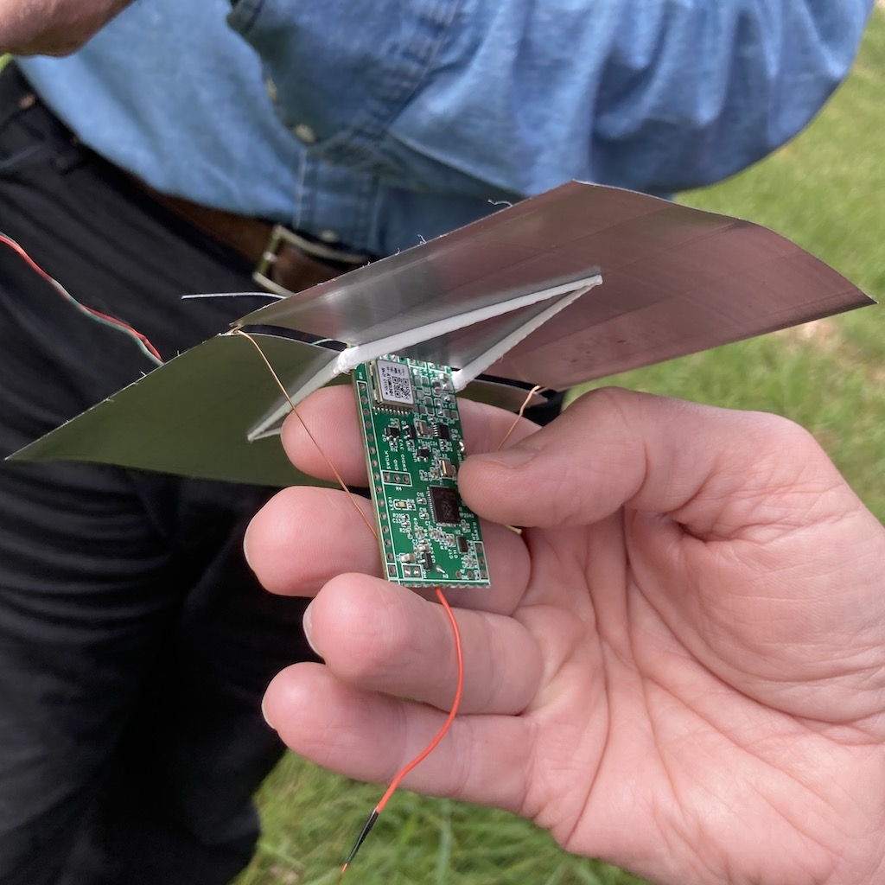

# sf-hab_rp2040_picoballoon_tracker_pcb_gen1
[sf-hab.org](https://sf-hab.org/) RP2040 based PicoBalloon Tracker PCB generation 1 for **STEM education**, designed by AG6NS

This [RP2040](https://www.raspberrypi.com/products/rp2040/) based PicoBalloon Tracker PCB gen1 project is intended for ***STEM*** *(Science, Technology, Engineering and Mathematics)* educational purposes.

[](pcb/tracker/v0.4/SCH_Schematic1_2023-09-11.pdf) 

   

   

## Documenation, Instruction and Q&A
Please refer to the [Wiki](https://github.com/kaduhi/sf-hab_rp2040_picoballoon_tracker_pcb_gen1/wiki)

## Question?
I will only answer questions from people who are a part of a STEM education program (student, teacher, mentor, advisor, ...), please send them via email (*my call sign* @ arrl.net).
The answers to these questions will also be added to the [Wiki](https://github.com/kaduhi/sf-hab_rp2040_picoballoon_tracker_pcb_gen1/wiki) for the benefit of all other STEM education groups.

**Note:** ***I will most likely ignore all emails from people who are not part of a STEM education program. If you are not a part of a STEM education program, please do not waste your time sending any questions.***

## How to open the ".eprj" CAD project file
When I started designing this PCB, I asked another member "What CAD software should I use?" and the answer was [**EasyEDA**](https://easyeda.com). I had only used Eagle before for designing my PCBs, so I had to learn it just for this project. The biggest reason we chose EasyEDA is because it is easy to link to the JLCPCB parts library. We only use [JLCPCB](https://jlcpcb.com) for [PCB fabrication](https://jlcpcb.com/capabilities/pcb-capabilities) and [PCB assembly service](https://jlcpcb.com/capabilities/pcb-assembly-capabilities), we thought this was a good decision at the time...

Anyway, this PCB was designed with a specific version of the [**EasyEDA Pro**](https://pro.easyeda.com) --- [***easyeda-pro-linux-x64-1.8.39***](https://image.easyeda.com/files/easyeda-pro-linux-x64-1.8.39.zip). You can download it from [Here](https://image.easyeda.com/files/easyeda-pro-linux-x64-1.8.39.zip).

## Firmware (Software)
Since my PicoBalloon firmware is still half baked, I have ported the existing well known PicoBalloon tracker firmware --- [**LightAPRS-W-2.0**](https://github.com/kaduhi/LightAPRS-W-2.0/tree/port_to_ag6ns_rp2040_picoballoon_tracker) to this Tracker board.

The ported version of the repository is added to this project as a git submodule, so once you clone this repository you need to do:
```
git submodule init
git submodule update
```

The original LightAPRS-W 2.0 tracker uses two different chips (Si5351A and Si4463) for supporting both HF and VHF bands, but my ported version only uses the Si5351A/MS5351M to generate both HF (WSPR in 20m band) and VHF (APRS in 2m band).

## License
[creative commons CC BY-NC-SA 4.0](https://creativecommons.org/licenses/by-nc-sa/4.0/)

[](https://creativecommons.org/licenses/by-nc-sa/4.0/legalcode.txt)

## Project Background and History
**Oct 2021** - attend to [SF-HAB (San Francisco Bay Area High Altitude Balloon) group](https://sf-hab.org/)'s Amateur Radio Pico Balloon presentation at Pacificon 2021, then joined the group

**Dec 2021** - start writing firmware for existing W6MRR V6.6 Pico Balloon Tracker boards

**Oct 2022** - at Pacificon 2022, meet a group of people from San Diego doing Pico Balloon / Ocean Buoy STEM educational programs for local high school students. They are looking for a new Tracker board that is specialized for their STEM education programs. They mentioned about the idea of using RP2040 as a controller chip, run tracker software in 1st CPU Core and MicroPython in 2nd Core for students to customize / extend the tracker functionalities. The tracker should be open source and open hardware, and not expensive

**Jan 2023** - during a SF-HAB online meeting, I was assigned to design a RP2040 based next generation Pico Balloon Tracker board

**Jan 2023** - start designing a tracker board

**Feb 2023** - order and receive the v0.1 prototype boards

**Mar 2023** - update design, order and receive the v0.2 prototype boards

**Apr 2023** - launch the v0.2 tracker [AG6NS-11](https://amateur.sondehub.org/#!mt=Mapnik&mz=8&qm=366d&f=AG6NS-11&q=AG6NS-11) from Hayward California, flown for 12 days then stop working above Iran

**May 2023** - launch another v0.2 tracker [K6EAU-11](https://amateur.sondehub.org/#!mt=Mapnik&mz=8&qm=366d&f=K6EAU-11&q=K6EAU-11) from Milpitas California, flown for 77.9 days (2.7 circumnavigations)

**May 2023** - update design, order and receive the v0.3 prototype boards

**Jun 2023** - launch the v0.3 tracker [W6MRR-27](https://amateur.sondehub.org/#!mt=Mapnik&mz=8&qm=366d&f=W6MRR-27&q=W6MRR-27) from Milpitas California, flown for 1.5 days (accumulated ice destroyed the balloon? altitude dropped from 13km to 3km during night, then slowly back to 13km)

**Jun 2023** - launch another v0.3 tracker [AG6NS-12](https://amateur.sondehub.org/#!mt=Mapnik&mz=11&qm=366d&f=AG6NS-12&q=AG6NS-12) from Milpitas California, flown for 1 day

**Jul 2023** - launch another v0.3 tracker [AG6NS-13](https://amateur.sondehub.org/#!mt=Mapnik&mz=8&qm=366d&f=AG6NS-13&q=AG6NS-13) from Milpitas California, flown for 1 day (balloon failure, landed in Mexico then keep transmitting signal for 3 days)

**Jul 2023** - update design, order and receive the v0.3.1 prototype boards

**Sep 2023** - launch the v0.3.1 tracker [AG6NS-14](https://amateur.sondehub.org/#!mt=Mapnik&mz=8&qm=366d&f=AG6NS-14&q=AG6NS-14) from Milpitas, California, flown for 1 day (balloon failure, landed near Mono Lake then keep transmitting signal for 53 days)

**Oct 2023** - launch another v0.3.1 tracker [AG6NS-15](https://amateur.sondehub.org/#!mt=Mapnik&mz=8&qm=366d&f=AG6NS-15&q=AG6NS-15) from Milpitas California, as of Mar 27 2024 still flying for 171 days and completed 16.8 circumnavigations

#

Kazuhisa "Kazu." Terasaki, AG6NS

if you are insterested in, [here](https://www.instagram.com/kazuterasaki/) is my latest updates
